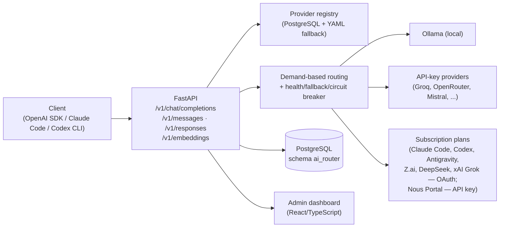

<p align="center">
  
</p>

<p align="center">
  Self-hosted LLM gateway that routes chat completions and embeddings across multiple providers with health-based selection, automatic fallback and demand-based routing — with an OpenAI-compatible API, a translator for the Anthropic Messages API and a translator for the OpenAI Responses API, all sharing the same routing pipeline and with end-to-end incremental streaming.
</p>

<p align="center">
  
  
  
</p>

---

## Overview

ForgeRouter sits in front of a pool of LLM providers — local models via Ollama, API-key providers (Groq, OpenRouter, Mistral and other configurable ones) and subscription plans via OAuth or API key (Claude Code, Codex, Antigravity, Z.ai, DeepSeek, xAI Grok, Nous Portal) — and exposes them as a single gateway. Just point any OpenAI-compatible client, Claude Code or the Codex CLI at it: the service handles provider selection, health checking and failover, so a provider outage or a free-tier plan's rate limit never brings down a request.

It was built for the Hermes ecosystem (canonical documentation in `CLAUDE.md`), but has no dependency on any specific vendor — it works as a generic LLM gateway in any installation (see [`INSTALL.md`](INSTALL.md) for standalone mode).

The service speaks three client protocols against the same routing/fallback pipeline, plus a dedicated embeddings endpoint:

- **`/v1/chat/completions`** and **`/v1/models`** — OpenAI-compatible, including streaming (SSE).
- **`/v1/messages`** — Anthropic Messages API, used by Claude Code. Streaming is real and incremental, translated chunk by chunk from the provider's response as it arrives — not a complete response replayed afterward as a synthetic SSE burst.
- **`/v1/responses`** — OpenAI Responses API, used by the Codex CLI (required since Codex removed Chat Completions support in v0.138). Same real, incremental streaming as `/v1/messages`.
- **`/v1/embeddings`** — OpenAI-compatible, going through the same health-based candidate selection and fallback used in chat.

The service includes a built-in admin dashboard for managing providers, agents, routing and usage — no separate service required.

## Key Features

- **Three client protocols, one router** — OpenAI Chat Completions, Anthropic Messages and OpenAI Responses are all translated into the same internal request and share the same candidate selection, fallback and health logic. All three stream incrementally from the real provider response.
- **Multi-provider routing** — mixes local (Ollama) and remote (API-key or subscription/OAuth) providers into a single pool, organized by priority tiers.
- **Health-based selection with automatic fallback** — candidates are tried in order; a failed, rate-limited or unhealthy provider is skipped in favor of the next healthy one. A specific `model` in the request is a *preference*, not an exclusive filter — the rest of the healthy pool remains available as fallback.
- **Demand-based routing** — virtual models (`forgerouter/auto`, `simple`, `standard`, `complex`, `reasoning`, `vision`, `audio`, `code`) classify each request from its content (image or audio parts, code fences/markers, reasoning language, prompt size) and route it through an ordered chain of concrete models.
- **In-memory routing intelligence** — per-provider circuit breaker (consecutive failures open it temporarily), sticky routing (an agent's last successful model for a given demand stays "stuck" for a short period, preserving provider prompt caches) and a dynamic score combining static model strength with recent success rate/latency.
- **Provider health scanner with background watchdog** — periodically sends real chat completions to each configured model and also detects *silent* failures (HTTP 200 with empty content, quota/billing/auth error text in the body), not just connection errors. A full scan runs as soon as the service starts, and a background check every 60s triggers an automatic rescan (limited to once every 5 minutes) whenever the healthy pool drops below a minimum.
- **Context compaction (lossless)** — strips incidental formatting/whitespace from messages before sending them to the provider; no semantic content is removed. Before/after token counts are logged per request.
- **Context truncation (lossy, opt-in)** — a safety valve for conversation histories that grow unchecked: when a request's estimated tokens exceed a configurable percentage of the *selected model's real context window*, the oldest turns are summarized by a cheap model (preserving names, decisions, numbers) and replaced with a condensed note, instead of overflowing the model's real limit. Disabled by default; falls back to a simple mechanical drop if the summarization fails.
- **API keys and per-agent controls** — issues a distinct API key per connected client/agent, restricts it to a subset of models or capability groups, sets a monthly reference cost budget, and classifies the agent as conversational or as an internal service consumer.
- **Reference cost estimation** — since ForgeRouter is built around free-tier routing, the real charged cost is almost always zero; it estimates what the request *would have cost* at the public commercial rates of an equivalent model, purely as an opportunity-cost metric.
- **Auditing without storing conversations** — ForgeRouter does not persist message bodies by design. The one limited exception is a ~100-character preview of the last user message per request, kept to audit what an agent is spending its quota on.
- **Admin dashboard** — React/TypeScript interface for managing providers, agents, routing/demand chains, pricing and usage, served directly by the API.
- **Database persistence with YAML fallback** — the provider registry lives in PostgreSQL; a built-in YAML file (`config/providers.yaml`) is used automatically if the database is unreachable or empty, so routing never stops because of it.

## Registered Providers and Models

ForgeRouter has native support and presets for multiple providers across the free and paid LLM ecosystem, with quick links to obtain keys and documentation:

| Provider | Access Type | Base URL | Official Website | Get Key / Token |
| :--- | :---: | :--- | :---: | :---: |
| **Groq** | `api_key` (Free) | `https://api.groq.com/openai/v1` | [groq.com](https://groq.com) | [Console Keys](https://console.groq.com/keys) |
| **Cerebras** | `api_key` (Free) | `https://api.cerebras.ai/v1` | [cerebras.ai](https://cerebras.ai) | [Cloud Portal](https://cloud.cerebras.ai) |
| **SambaNova Cloud** | `api_key` (Free) | `https://api.sambanova.ai/v1` | [sambanova.ai](https://sambanova.ai) | [Cloud APIs](https://cloud.sambanova.ai/apis) |
| **Google Gemini Studio** | `api_key` (Free) | `https://generativelanguage.googleapis.com/v1beta/openai` | [aistudio.google.com](https://aistudio.google.com) | [API Keys](https://aistudio.google.com/app/apikey) |
| **GitHub Models** | `api_key` (Free) | `https://models.github.ai/inference` | [github.com](https://github.com/marketplace/models) | [Personal Tokens](https://github.com/settings/tokens) |
| **Hugging Face** | `api_key` (Free) | `https://api-inference.huggingface.co/v1` | [huggingface.co](https://huggingface.co) | [Access Tokens](https://huggingface.co/settings/tokens) |
| **ModelScope (Aliyun)** | `api_key` (Free) | `https://api-inference.modelscope.cn/v1` | [modelscope.cn](https://modelscope.cn) | [SDK Tokens](https://modelscope.cn/my/myaccesstoken) |
| **SiliconFlow (SiliconCloud)** | `api_key` (Free) | `https://api.siliconflow.cn/v1` | [siliconflow.cn](https://siliconflow.cn) | [Account Keys](https://cloud.siliconflow.cn/account/ak) |
| **Together AI** | `api_key` (Free/Paid) | `https://api.together.xyz/v1` | [together.ai](https://www.together.ai) | [API Keys](https://api.together.xyz/settings/api-keys) |
| **Fireworks AI** | `api_key` (Free/Paid) | `https://api.fireworks.ai/inference/v1` | [fireworks.ai](https://fireworks.ai) | [API Keys](https://fireworks.ai/api-keys) |
| **Hyperbolic** | `api_key` (Free/Paid) | `https://api.hyperbolic.xyz/v1` | [hyperbolic.xyz](https://hyperbolic.xyz) | [Settings](https://app.hyperbolic.xyz/settings) |
| **DeepInfra** | `api_key` (Free/Paid) | `https://api.deepinfra.com/v1/openai` | [deepinfra.com](https://deepinfra.com) | [Dashboard Keys](https://deepinfra.com/dash/api_keys) |
| **OVHcloud AI Endpoints** | `api_key` (Free) | `https://oai.endpoints.kepler.ai.cloud.ovh.net/v1` | [ovhcloud.com](https://www.ovhcloud.com) | [OVH Manager](https://www.ovh.com/manager) |
| **Novita AI** | `api_key` (Free/Paid) | `https://api.novita.ai/openai/v1` | [novita.ai](https://novita.ai) | [Key Management](https://novita.ai/settings/key-management) |
| **Pollinations.ai** | `api_key` (Free/Open) | `https://text.pollinations.ai/openai` | [pollinations.ai](https://pollinations.ai) | [Open Access](https://pollinations.ai) |
| **Mistral AI** | `api_key` (Free/Paid) | `https://api.mistral.ai/v1` | [mistral.ai](https://mistral.ai) | [Console Keys](https://console.mistral.ai/api-keys) |
| **Cohere** | `api_key` (Free/Trial) | `https://api.cohere.ai/compatibility/v1` | [cohere.com](https://cohere.com) | [Dashboard Keys](https://dashboard.cohere.com/api-keys) |
| **Cloudflare Workers AI** | `api_key` (Free) | `https://api.cloudflare.com/.../ai/v1` | [cloudflare.com](https://ai.cloudflare.com) | [API Tokens](https://dash.cloudflare.com/profile/api-tokens) |
| **OpenRouter** | `api_key` (Free/Paid) | `https://openrouter.ai/api/v1` | [openrouter.ai](https://openrouter.ai) | [Keys](https://openrouter.ai/keys) |
| **NVIDIA NIM** | `api_key` (Free Credits) | `https://integrate.api.nvidia.com/v1` | [build.nvidia.com](https://build.nvidia.com) | [NVIDIA Build](https://build.nvidia.com) |
| **Claude Code** | `subscription` (OAuth) | Dedicated handler / Anthropic | [anthropic.com](https://anthropic.com) | `~/.claude/.credentials.json` |
| **Google Antigravity** | `subscription` (OAuth) | Dedicated handler / Cloud API | [cloud.google.com](https://cloud.google.com) | `~/.gemini/antigravity-cli` |
| **OpenAI Codex** | `subscription` (OAuth) | Dedicated handler / Codex | [chatgpt.com](https://chatgpt.com) | `~/.codex` |
| **Z.ai (Zhipu GLM)** | `subscription` / `api_key` | `https://api.z.ai/api/coding/paas/v4` | [z.ai](https://z.ai) | [Z.ai Portal](https://z.ai) |
| **Ollama Local** | `local` | `http://127.0.0.1:11434/v1` | [ollama.com](https://ollama.com) | Local / No Key |

> **Note on Meta-Routers / Auto LLMs:** All models that act as meta-routers (e.g. `openrouter/auto`, `openrouter/free`, `kilo-auto/*`, `pareto-code`, `fusion`) are automatically excluded and blocked to preserve ForgeRouter's strict control over latency, health and routing fidelity.


## Architecture

```text
Client (OpenAI SDK, Claude Code, Codex CLI, curl, ...)
        │
        ▼
 POST /v1/chat/completions  ·  /v1/messages  ·  /v1/responses  ·  /v1/embeddings
        │                       (translated into a Chat
        │                        Completions request and back)
        ▼
 Loads the provider registry (PostgreSQL, with YAML fallback)
        │
        ▼
 Classifies the demand (auto/simple/standard/complex/reasoning/vision/audio/code)
        │
        ▼
 Infers capability → filters healthy/enabled candidates → orders by
 demand chain, tier and dynamic score
        │
        ▼
 Context compaction (lossless) → truncation (opt-in, lossy) →
 tries the candidates in order
        │
        ├─ success ───────────► response sent/streamed to the client
        │
        └─ failure ── logs route event, marks unhealthy ── tries the next
                                                                       │
                                                        all failed ┴─► 502 all_providers_failed
```



Each provider has an `api_format` (`openai` or `anthropic`) describing its connection protocol; most subscription plans (Claude Code, Codex, Antigravity, Z.ai, DeepSeek, xAI Grok) go through dedicated plan handlers (`app/providers/plans.py`) that manage OAuth tokens instead of static API keys — Z.ai is the only one that also accepts a paid API key (`api.z.ai/api/coding/paas/v4`) as an alternative path to OAuth. Nous Portal has no dedicated handler and no OAuth: there is no public OAuth authorization server for third-party apps to register with, and — verified in practice — the account's prepaid credit requirement applies equally to the static API key and to CLI login (`hermes proxy`), so it's just a static API key pasted into the dashboard, the same as Moonshot/MiniMax/Ollama Cloud (see `docs/SUBSCRIPTION_NOUS_PORTAL_REFERENCE.md`).

## Technologies

| Layer | Technology |
|---|---|
| Backend | Python 3.11+, FastAPI, Uvicorn |
| Persistence | PostgreSQL (schema `ai_router`, accessed via `psycopg`) |
| Frontend / Dashboard | React, TypeScript, Vite |
| Token counting | `tiktoken` (`cl100k_base`) |
| Tests | `pytest` (40 test files, no real database/providers) |
| Containerization | Docker, Docker Compose |
| WASM runtime | `wasmtime` (execution isolation) |

## Project Structure

```text
forgerouter/
├── app/
│   ├── main.py               # FastAPI app: /v1/*, /auth/*, /admin/* routes
│   ├── registry.py           # Provider registry (DB + YAML fallback)
│   ├── demand.py             # Demand classification (auto/code/vision/...)
│   ├── ranking.py            # Candidate ordering (tier, dynamic score)
│   ├── routing_state.py      # Circuit breaker, sticky routing, performance cache
│   ├── normalize.py          # Context compaction and truncation
│   ├── pricing.py            # Reference cost estimation
│   ├── health_watchdog.py    # Automatic background rescans
│   ├── storage.py            # All PostgreSQL access (raw SQL via psycopg)
│   ├── deploy_config.py      # Writes config/key to external agents
│   ├── providers/            # Per-provider/plan clients (openai, anthropic,
│   │                         # claude_code, codex, antigravity, zai,
│   │                         # deepseek_web, xai_grok)
│   └── validation/           # Health scanner and classification
├── config/
│   ├── providers.yaml            # Fallback registry (used without DB)
│   ├── model_pricing*.json       # Pricing catalogs (vendored/live/overrides)
├── db/                        # Numbered SQL migrations (applied manually)
├── docs/                      # PRD, spec, per-provider subscription references
├── frontend/                  # React/TypeScript dashboard (build in frontend/dist)
├── scripts/                   # build, pricing sync, health scan, OAuth login, etc.
├── tests/                     # pytest suite (FastAPI TestClient, everything mocked)
├── docker-compose.yml             # Deploy into the Hermes/Foundation ecosystem
├── docker-compose.local.yml       # Same as above, with host networking (local Ollama)
├── docker-compose.standalone.yml  # Standalone deploy, with embedded PostgreSQL
├── Dockerfile
├── INSTALL.md                 # Step-by-step standalone installation guide
└── CLAUDE.md                  # Architecture guide for agents/developers
```

## Prerequisites

- Docker and Docker Compose
- Optional: [Ollama](https://ollama.com) running locally, for fallback with a local model
- Everything else (Python 3.11+, dependencies, Node/Vite) is already bundled into the Docker image — no Python/Node runtime is needed on the host to run the service

## Installation

**Running ForgeRouter standalone?** Use the standalone installer — it bundles its own PostgreSQL container, so there's nothing to provision beforehand:

```bash
git clone https://github.com/marcelodarckferreira/ForgeRouter.git
cd ForgeRouter
./scripts/install_standalone.sh
```

The script creates `.env` from `.env.example` (if missing), generates random database passwords, brings up PostgreSQL, applies the schema, builds the image and starts ForgeRouter. It's safe to run again — every step is idempotent. See [`INSTALL.md`](INSTALL.md) for the equivalent manual step-by-step, what the script deliberately doesn't do, and backup notes.

Check that it's up:

```bash
curl http://127.0.0.1:2100/health
# {"status":"ok","version":"0.1.0","git_sha":"<commit>"}
```

The dashboard lives at `http://127.0.0.1:2100/` — the default login is `admin` / `admin`, with a mandatory password change on first access.

> **Deploying alongside an existing PostgreSQL and an external Docker network** (for example, as part of a larger multi-service setup)? Use `docker-compose.yml` directly: point `DATABASE_URL` at your database, apply `db/*.sql` manually and in order against it, join your own external Docker network in place of `foundation_network`, and run `./scripts/build.sh && docker compose up -d`. `docker-compose.local.yml` is the same idea with host networking, to reach a local Ollama at `127.0.0.1:11434`:
> ```bash
> docker compose -f docker-compose.local.yml up -d --build
> ```

## Configuration

ForgeRouter's own behavior is tuned by a small set of environment variables; the provider/model/agent registry lives in PostgreSQL and is managed at runtime through the dashboard or the `/admin/*` endpoints — `.env` only needs credentials, not the registry itself.

```bash
cp .env.example .env
```

| Variable | Required | Description |
|---|---:|---|
| `DATABASE_URL` | Yes | PostgreSQL connection string |
| `DATABASE_CONNECT_TIMEOUT` | No | Connection timeout in seconds (default `5`) |
| `POSTGRES_HOST` / `POSTGRES_PORT` / `POSTGRES_DB` / `POSTGRES_USER` / `POSTGRES_PASSWORD` | Standalone mode only | Credentials for the embedded Postgres container (`docker-compose.standalone.yml`) |
| `PROXYROUTER_PASSWORD` | Standalone mode only | Password for the restricted `proxyrouter_user` role, which the service actually uses to connect to the database |
| `<PROVIDER>_API_KEY` (e.g. `GROQ_API_KEY`, `OPENROUTER_API_KEY`, `MISTRAL_API_KEY`, `GEMINI_API_KEY`) | No | Per-provider API keys — only for enabled providers, matching each one's `api_key_env` in `config/providers.yaml` |
| `FORGEHUB_SSO_SECRET` | No | Optional shared secret for trusted SSO from a partner application (server-to-server) |
| `AUTO_INCLUDE_MIN_HEALTHY` | No | Minimum number of healthy candidates before models degraded by a runtime failure (e.g. rate-limited) re-enter routing as a last-resort reserve (default `3`) |
| `BREAKER_THRESHOLD` | No | Consecutive failures from a provider before the in-memory circuit breaker opens (default `4`) |
| `BREAKER_COOLDOWN_SECONDS` | No | How long an open breaker stays open before a half-open probe (default `120`) |
| `STICKY_TTL_SECONDS` | No | How long an agent's last successful model for a demand stays "stuck" (default `600`) |
| `ENABLE_PAID_FALLBACK` / `REDACT_SECRETS` / `LOG_PROMPTS` | No | Security/logging flags in `.env.example` |

Everything else — which providers are enabled, which models they expose, demand-based routing chains, context compaction/truncation, agent keys and budgets, pricing sync — is configured live through the dashboard and persisted in PostgreSQL, with no need for an environment variable or redeploy.

Authentication with the OAuth subscription providers (Claude Code, Codex, Antigravity, Z.ai, DeepSeek, xAI Grok) doesn't use `.env`: each handler reads the OAuth token already maintained by its respective CLI (`~/.codex`, `~/.gemini`, `~/.claude/.credentials.json`, `~/.zai`, `~/.deepseek`), except xAI Grok, whose login (`scripts/xai_oauth_login.py`) and token refresh are performed by ForgeRouter itself (`~/.xai/auth.json`, mounted with write access). Nous Portal is a plain API key (`portal.nousresearch.com` → API Keys, requires account credit), pasted into the dashboard like any API-key provider — no mounted file, no external process. Per-provider details in `docs/SUBSCRIPTION_*_REFERENCE.md`.

### Local Subscription Providers (OpenAI Codex, Claude Code and Google Antigravity)

ForgeRouter integrates natively with coding subscriptions already authenticated on the host machine, allowing it to consume those accounts' quotas without needing to register paid API keys in the dashboard:

1. **OpenAI Codex (`openai-codex`):**
   - **Authentication:** Requires the official Codex CLI (`codex`) to be logged in on the host (`~/.codex/auth.json`).
   - **How to enable:** In the ForgeRouter dashboard, select the **OpenAI Codex** plan, leave the API key field empty (authentication is resolved automatically from the mounted file), click **"Detect models"** and save.
   - **Routing:** Calls are translated to Codex's Responses protocol (`chatgpt.com/backend-api/codex`).

2. **Claude Code (`claude-code`):**
   - **Authentication:** Requires the official Claude CLI (`claude`) to be authenticated on the host (`~/.claude/.credentials.json`).
   - **How to enable:** In the dashboard, select the **Claude Code** plan, leave the key field empty, click **"Detect models"** and save.
   - **Routing:** Requests are sent to the Anthropic Messages API (`api.anthropic.com/v1/messages`) using Claude Code's OAuth headers.

3. **Google Antigravity (`google-antigravity`):**
   - **Authentication:** Requires the `agy` CLI to be logged into your Google account on the host (`~/.gemini/antigravity-cli`).
   - **How to enable:** In the dashboard, select **Google Antigravity**, leave the key blank, click **"Detect models"** to list your account's available models (`gemini-3.7-flash`, `gemini-3.6-flash`, `gemini-3.1-pro`, etc.) and save.
   - **Routing:** ForgeRouter runs the `agy` binary directly via a subprocess inside the container, streaming completions with full token-counting support.

#### How the system keeps accounts and tokens always active (Keepalive)

OAuth tokens issued to local CLIs have an expiration and lapse if the utilities stay idle for long periods:

1. **Renewal through traffic and Health Scan:** Whenever a request is routed, or when ForgeRouter's cron runs the periodic health scan (`scripts/health_scan_sync.py` every 10 minutes), the credentials get exercised.
2. **Dedicated Keepalive script (`scripts/keepalive_subscriptions.sh`):** To make sure accounts never go idle even without user traffic, a cronjob on the host runs lightweight checks every 30 minutes:
   - `codex doctor --summary`: validates diagnostics and renews the tokens in `~/.codex/auth.json`.
   - `claude -p "ping" --dangerously-skip-permissions`: performs a non-interactive ping keeping `~/.claude/.credentials.json` active.
   - `agy models`: queries Google's remote catalog, renewing session tokens in the keyring and in `~/.gemini/`.
   - **Host Crontab schedule:**
     ```bash
     */30 * * * * flock -n /tmp/subscription-keepalive.lock /root/project/forgerouter/scripts/keepalive_subscriptions.sh >> /var/log/subscription-keepalive.log 2>&1
     ```

## Running the Project

### Docker (production / normal use)

```bash
docker compose up -d
```

### Local development

```bash
# Rebuilds the dashboard after frontend changes, then rebuilds the image
cd frontend && npm install && npm run build && cd .. && ./scripts/build.sh

# Starts with host networking, required to reach a local Ollama at 127.0.0.1:11434
docker compose -f docker-compose.local.yml up -d --build
```

> Always use `./scripts/build.sh`, not a plain `docker compose build`: it bakes the current commit into the image (exposed at `GET /health`) and retags the result as `forgerouter:<VERSION>` + `forgerouter:latest`, ensuring standalone `docker run` commands (scanner, cron) always run the current code.

## Application Access

| Service | URL |
|---|---|
| API / Dashboard | `http://127.0.0.1:2100` |
| Health check | `http://127.0.0.1:2100/health` |

## API

Base URL: `http://127.0.0.1:2100`. Authentication on `/v1/*` endpoints and on write admin endpoints is via `Authorization: Bearer <agent-key>` (a key issued per agent in `ai_router.agents`) or a dashboard session — there is no master key in the environment. Protection only activates automatically once at least one agent is enabled; with no agents (or no database), the admin area stays open for initial setup.

**Routing endpoints (client-compatible):**

```http
POST /v1/chat/completions
POST /v1/messages
POST /v1/responses
POST /v1/embeddings
GET  /v1/models
```

**Dashboard authentication:**

```http
POST /auth/login
POST /auth/sso
GET  /auth/me
POST /auth/change-password
POST /auth/logout
```

**Administration (public reads, writes protected by agent key/session)** — provider management (`/admin/providers/*`: registry, health, readiness, rescan, resync, discover-models, validate, CRUD), agents (`/admin/agents/*`: creation, key rotation/reveal, duplication, allowed models, budget, deploy-config), demand-based routing (`/admin/demand-routes/*`), context settings (`/admin/settings/context-compaction`, `/admin/settings/context-truncation`), pricing (`/admin/pricing/*`) and usage (`/admin/usage/*`, `/admin/routes/recent`). FastAPI exposes the standard interactive documentation at `/docs` (Swagger UI) and `/openapi.json`; the full endpoint surface is in `app/main.py`.

## Database

PostgreSQL, schema `ai_router`, managed by the Foundation ecosystem in integrated deployments or by its own container in standalone mode. There is no migration tool — the schema lives in `db/*.sql`, numbered files applied manually and in order:

```bash
for f in db/*.sql; do
  docker compose -f docker-compose.standalone.yml exec -T postgres \
    psql -U forgerouter_user -d forgerouter -v ON_ERROR_STOP=1 < "$f"
done
```

Main tables: `providers`, `models`, `provider_health` (append-only history), `route_events` (one row per provider attempt, with agent attribution), `usage_monthly` (monthly rollup per agent), `agents`, `agent_models`, `users` + `sessions` (dashboard login), `subscription_catalog`, `settings`. Design rationale in [`docs/DATABASE_DECISION.md`](docs/DATABASE_DECISION.md).

## Docker

| File | Scenario |
|---|---|
| `docker-compose.yml` | Deploy integrated into the Hermes/Foundation ecosystem: external Docker network (`foundation_network`), already-provisioned PostgreSQL, mounts for restarting sibling agents via the host's systemd/D-Bus |
| `docker-compose.local.yml` | Same as above, with `network_mode: host`, to reach a local Ollama at `127.0.0.1:11434` |
| `docker-compose.standalone.yml` | Standalone installation: embedded PostgreSQL, no dependency on an external network or on systemd/D-Bus mounts |

The application's single service listens on port **2100**. All three files mount (read-only, except where noted) each subscription plan's OAuth login files (`~/.codex`, `~/.gemini`, `~/.claude/.credentials.json`, `~/.zai`, `~/.deepseek`, `~/.xai` — this one with write access, since ForgeRouter itself renews the token) and the pricing catalogs (`config/model_pricing*.json`, with write access, to persist the result of `POST /admin/pricing/sync`). Nous Portal needs no mount at all — it's a paid API key like any other.

## Security

- **No master key**: write admin endpoints require the key of a registered agent or a valid dashboard session; protection turns on by itself as soon as an agent is enabled.
- **Hashed passwords**: dashboard users use PBKDF2 (`ai_router.users`); sessions expire after 7 days.
- **No secret is ever exposed by the API**: readiness/registry endpoints only return environment variable names and a "configured" boolean, never the key value.
- **No conversation is persisted** by design — the one exception is a ~100-character preview of the last user message, for quota-usage auditing (`route_events.prompt_preview`).
- **Database failures never bring down routing**: every persistence call in the request path is protected by try/except, with a fallback to YAML when the database is unavailable.
- Real secrets (`.env`) must never be committed; use `.env.example` as the format reference.

## Tests

```bash
# Full suite
docker compose run --rm forgerouter pytest -q

# A specific file or test
docker compose run --rm forgerouter pytest tests/test_chat_fallback.py -q
docker compose run --rm forgerouter pytest tests/test_chat_fallback.py::test_chat_falls_back_to_next_candidate -q
```

The suite (40 files in `tests/`) uses FastAPI's `TestClient` and monkeypatches the functions imported into `app.main` (registry, chat, persistence) — no real database or provider is required to run it. An `autouse` fixture in `tests/conftest.py` resets the in-memory routing state (circuit breaker, sticky routing) between tests.

## Deploy

There is no CI/CD pipeline (GitHub Actions or similar) in this repository — build and deploy are manual via `./scripts/build.sh` and `docker compose up -d`, with the current commit baked into the image and exposed at `GET /health` for verification against `docker images` or `git rev-parse HEAD`. Suggested cron routines (batch health scan and pricing sync) are documented in the scripts themselves:

```bash
# Batch health scan (percentage of the pool per run, for cron)
docker run --rm --network foundation_network --add-host=host.docker.internal:host-gateway \
  --env-file .env -e PYTHONPATH=/app forgerouter:latest python3 scripts/health_scan_sync.py --percent 20

# Reference pricing sync (catalog + live pricing + historical backfill)
docker run --rm --network foundation_network --add-host=host.docker.internal:host-gateway \
  --env-file .env -e PYTHONPATH=/app forgerouter:latest python3 scripts/sync_pricing.py
```

## Observability

- **`GET /health`** — status, version and `git_sha` of the running image.
- **`GET /admin/providers/health`** and **`/admin/routes/recent`** — per-model health history and recent routing attempts.
- **`GET /admin/usage`** and **`/admin/usage/yearly[-by-demand]`** — aggregated usage per agent/year/month, including tokens saved by context compaction.
- Health scanner with background watchdog (`app/health_watchdog.py`) triggers automatic rescans when the healthy pool drops below the configured minimum.

## Additional Documentation

- [`INSTALL.md`](INSTALL.md) — standalone installation guide, manual step-by-step and backup notes.
- [`CLAUDE.md`](CLAUDE.md) — architecture and convention guide for development/agents in this repository.
- [`docs/DATABASE_DECISION.md`](docs/DATABASE_DECISION.md) — rationale for choosing Foundation-managed PostgreSQL.
- [`docs/HERMES_AI_PROXY_ROUTER_PRD_v2.md`](docs/HERMES_AI_PROXY_ROUTER_PRD_v2.md) — product PRD.
- `docs/SUBSCRIPTION_ZAI_REFERENCE.md`, `docs/SUBSCRIPTION_DEEPSEEK_REFERENCE.md`, `docs/SUBSCRIPTION_XAI_GROK_REFERENCE.md`, `docs/SUBSCRIPTION_NOUS_PORTAL_REFERENCE.md` — authentication reference for each subscription plan.

## Usage

```bash
curl http://127.0.0.1:2100/v1/chat/completions \
  -H "Content-Type: application/json" \
  -H "Authorization: Bearer <agent-key>" \
  -d '{
    "model": "forgerouter/auto",
    "messages": [{"role": "user", "content": "Hello!"}]
  }'
```

Requesting a specific demand class instead of automatic classification:

```bash
curl http://127.0.0.1:2100/v1/chat/completions \
  -H "Content-Type: application/json" \
  -H "Authorization: Bearer <agent-key>" \
  -d '{"model": "forgerouter/code", "messages": [{"role": "user", "content": "Write a bubble sort in Rust"}]}'
```

Listing the available models:

```bash
curl http://127.0.0.1:2100/v1/models
```

Requesting an embedding:

```bash
curl http://127.0.0.1:2100/v1/embeddings \
  -H "Content-Type: application/json" \
  -H "Authorization: Bearer <agent-key>" \
  -d '{"model": "auto", "input": "Hello, world!"}'
```

Any OpenAI-compatible SDK works by pointing `base_url` at `http://127.0.0.1:2100/v1`. Claude Code and the Codex CLI can point directly at `http://127.0.0.1:2100` (`/v1/messages` and `/v1/responses`, respectively), using an agent's API key as the bearer token.

## Contributing

There is no `CONTRIBUTING.md` in this repository. When proposing changes, follow the conventions already documented in [`CLAUDE.md`](CLAUDE.md) (testing standards, routing design rules) and run the test suite before opening a change:

```bash
git checkout -b feature/feature-name
docker compose run --rm forgerouter pytest -q
git commit -m "feat: descrição"
```

## License

This project is licensed under the [Mozilla Public License 2.0](LICENSE).

## Author

Marcelo D. Ferreira ([marcelodarckferreira](https://github.com/marcelodarckferreira)).
